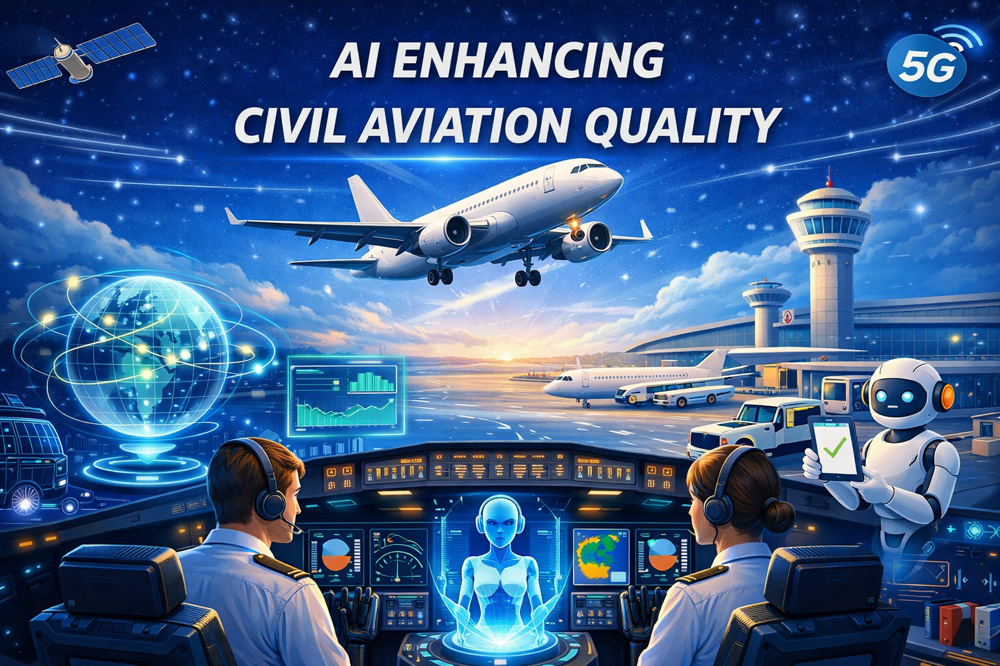

# Awesome Civil Flight Papers

A curated list of papers, surveys, benchmarks, datasets, and code repositories on **civil flight**.

## Contents
- [Surveys](#surveys)
- [Benchmarks and Datasets](#benchmarks-and-datasets)
- [Methods](#methods)
- [Resources](#resources)

## Surveys
- [Paper Title](paper_link), *Venue*, Year.

## Benchmarks and Datasets
- [Paper Title](paper_link), *Venue*, Year. [Code](code_link)

## Methods

### Topic A
- [Paper Title](paper_link), *Venue*, Year.
- Yingxiao Kong, Xiaoge Zhang, and Sankaran Mahadevan. "Bayesian deep learning for aircraft hard landing safety assessment." IEEE transactions on intelligent transportation systems 23, no. 10 (2022): 17062-17076.

### Topic B
- [Paper Title](paper_link), *Venue*, Year.

## Resources
- [Project Name](link) - short description.

## Contributing
Contributions are welcome. Please open an issue or submit a pull request.
